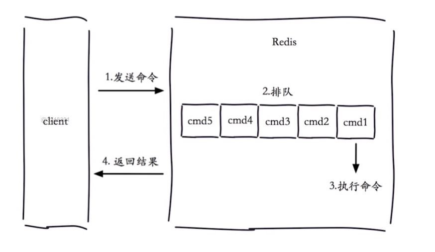
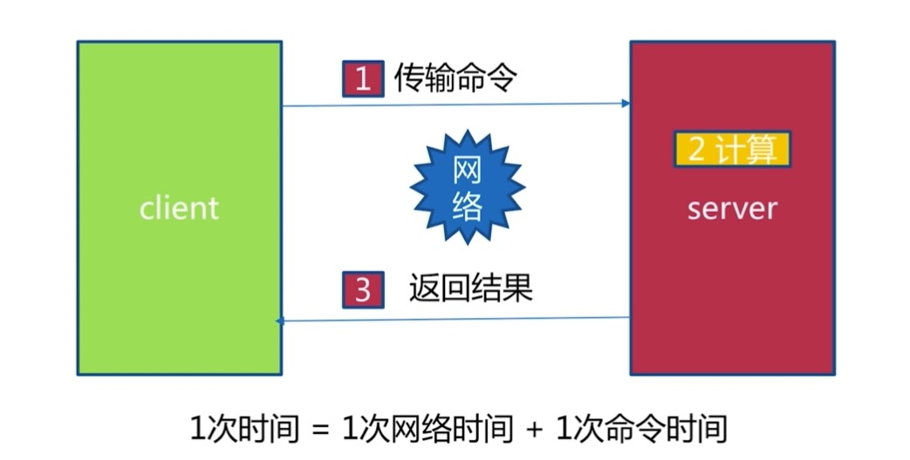
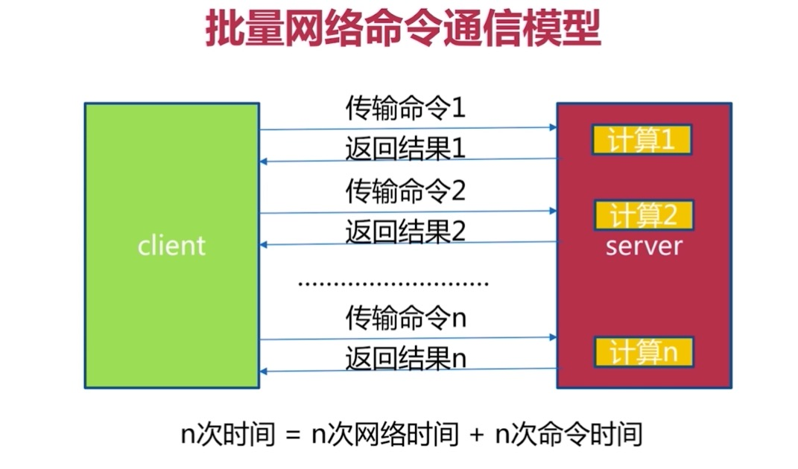
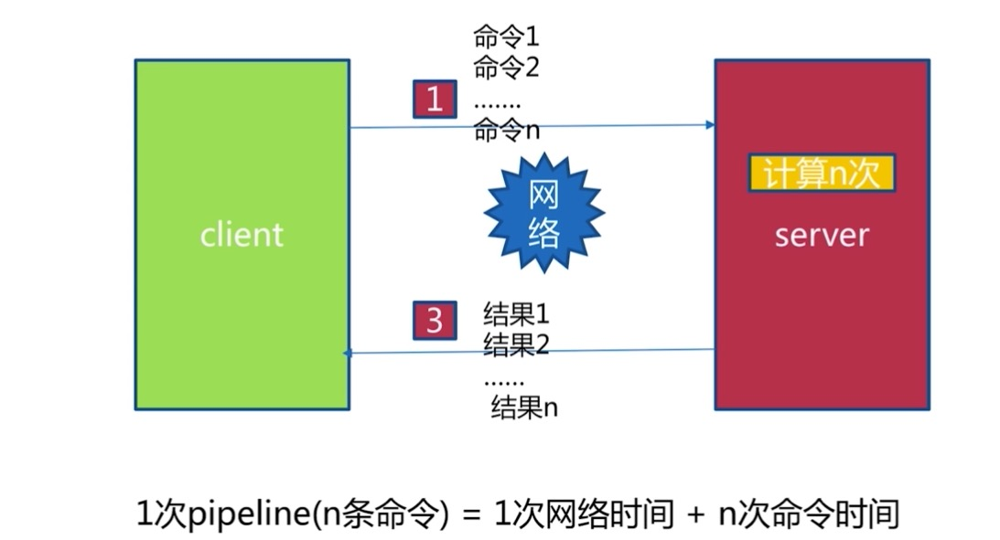
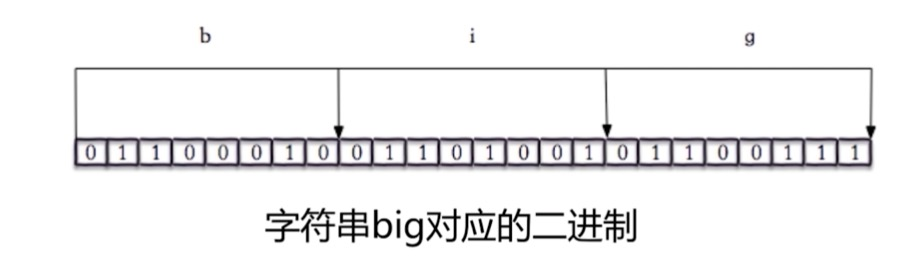
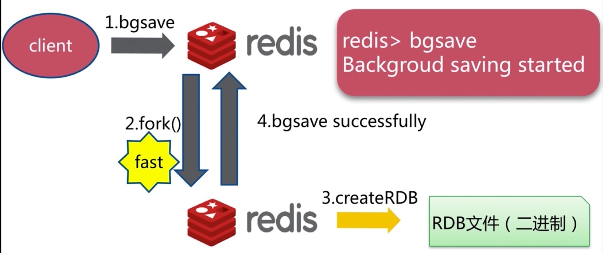
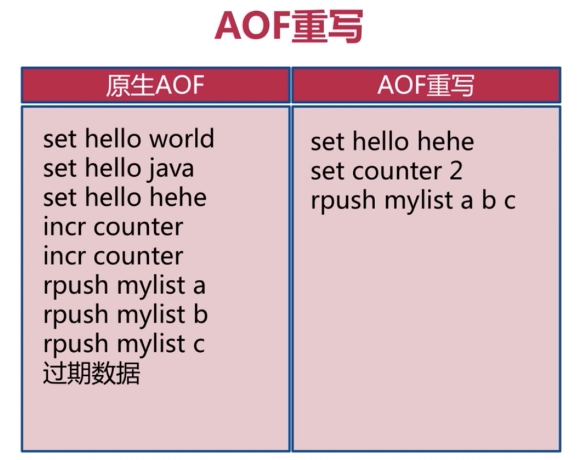
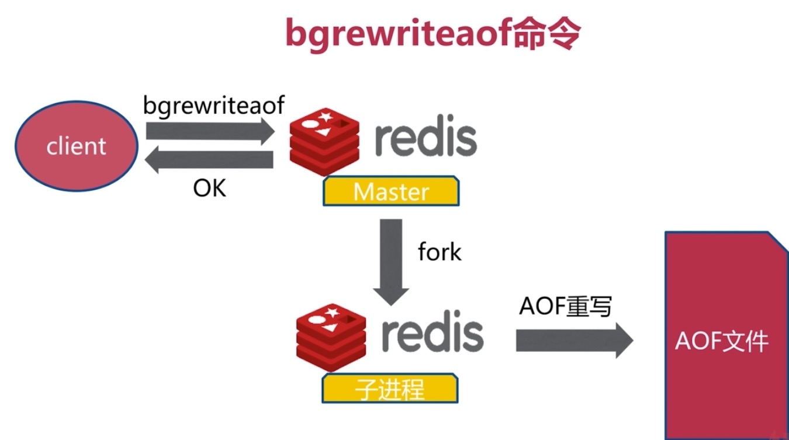

# 开篇之词

redis是一个开源的key-value型数据库，当前互联网的很多公司都有应用他

那么作为学习之用，我这里提供一个中文镜像官网

```
http://www.redis.cn/
```

# 一、安装redis

## 1.1 系统环境

Centos7.0

## 1.2安装命令

需要说明的是本次安装的版本是：5.0.7版本

参考如下的网址

```
https://redis.io/download
```

这里需要说明的是配置文件

```
# 在解压后的目录中有个redis.conf文件
mkdir config
cp redis.conf config/
```

配置项

```
daemonize yes # 后台启动
port 6382   # 端口号
dir "/home/redis/data" # 数据工作目录
logfile "6382.log"  # 日志文件
```

启动redis

```
redis-server config/redis.conf
```

查看是否存在进程

```
ps -ef | grep redis-server | grep 6382
```

# 二、redis数据类型及其操作

redis包含5种数据类型，分别是：字符串类型、哈希类型、列表类型、集合类型、有序集合类型

我这里不会进行详细的API的说明，因为本文档侧重于研究redis更深层次的知识，这些简单的知识参考一下文档就可以了，比如下面这个文档

```
https://www.runoob.com/redis/redis-tutorial.html
```

当然了，也可以参考如下地址，输入你想了解的命令搜索也是可以的

```
http://www.redis.cn/commands.html
```

# 三、redis的客户端

关于redis的客户端支持很多中语言，PHP，Java，python，可以参考下面的地址来进行查找

```
https://redis.io/clients
```

在每种客户端都会有多个可选择，那么选择带有笑脸和星号的则为首选

## 3.1 redis的java客户端

关于这一部分，可以参考下面的文档

```
https://github.com/xetorthio/jedis
```

## 3.2 python的客户端

参考地址如下：

```
https://github.com/andymccurdy/redis-py
```

## 3.3 PHP的客户端

因为本人是学PHP的，所以关于这一部分着重的说明

从安装PHP起步，一步步实现搭建过程。

第一步从PHP官网下载PHP，执行解压命令，本次安装的PHP是最新版本PHP7.4.1，执行解压之后

为了正确安装PHP，需要提前安装一些第三方依赖

```
yum install autoconf automake libtool re2c flex bison libxml2-devel gcc gcc++ openssl openssl-devel -y
```

然后编译安装PHP

```
tar -zxvf php-7.4.1.tar.gz
mkdir php
cd php-7.4.1
./configure --prefix=/home/php/php --enable-fpm --with-openssl
make && make install
```

然后就可以使用Predis库了，值得开心的是，使用这个不需要安装redis扩展

地址：

```
https://github.com/nrk/predis
```

当然了，对于英语困难的小伙伴可以参考下面的中文文档

```
http://www.koukousky.com/%E9%A6%96%E9%A1%B5/1641.html
```

我本地也备份了一份，可以参考[predis中文文档](./predis中文文档.md),右键打开连接即可查看。

# 四、redis的多种功能

## 4.1慢查询

先来看一下redis的生命周期，看图说话



首先声明一点，redis是单线程的。

当客户端发送命令之后，会将命令放到一个执行队列中，然后从队列中取出命令开始执行，再返回结果，这是redis执行的生命周期

那么所说的慢查询就是发生在第三阶段，执行命令阶段

需要注意一点：客户端超时不一定是慢查询，但慢查询是客户端超时的一个可能因素

关于慢查询的两个配置，支持动态配置

```
# 慢查询队列的长度，这个队列是存在于内存中，先进先出
slowlog-max-len = 128
# 规定多长时间的进入慢查询队列中，这里单位是微妙 ，10000就是10毫秒
slowlog-log-slower-than = 10000
```

关于慢查询的命令

```
slowlog get [n] # 获取慢查询队列
slowlog len     # 获取慢查询队列的长度
slowlog reset   # 清空慢查询队列
```

关于慢查询的运维经验

```
slowlog-max-len不要设置过大，默认10ms，通常设置1ms
slowlog-log-slower-than不要设置过小，通常设置1000作用
定期持久化慢查询
```

## 4.2 pipeline

先来说一下什么是pipeline？翻译过来就是流水线，接下来，我将结合图的方式来说明



首先我们看到上图，客户端传输命令到服务端然后执行命令再返回结果，这个过程，我们把传输命令加上返回结果的时间称之为一次网络时间，那么1次时间就是 1次网络时间加上1次命令时间



有了第一幅图的解释，我们再来看第二幅图，第一幅图说的是一次命令的执行时间，那么如果多个命令呢？

所以n次时间就等于n次网络时间加上n次命令时间。

那么我们来分析一下如何节省时间呢？我们知道，执行命令的时间其实是很短的，都是微妙级别的，关键在于网络时间，如果把多个命令一次进行传输呢？对的，这就是pipeline提供的功能



那么我们就知道通过1次网络时间，就执行了n条命令

接下来看一下一个极端的例子计算网络的时间


可以看出从北京到上海一次执行时间是13毫秒，网络时间严重影响了整体时间，这也是使用pipeline的原因。

注意：虽然pipeline可以节省网络时间，但是也不要每次携带的命令过多

另外还可以参考如下文档理解

```
http://www.redis.cn/topics/pipelining.html
```

## 4.3 发布订阅

发布订阅这个功能其实简单来说就是分开看，发布和订阅，有点类似于kafka的生产者和消费者，以下是命令解释

```
publish channel message # 向对应的频道发布消息
subscribe [channel] # 订阅频道 一个或者多个
psubscribe [pattern...] # 订阅模式
punsubscribe [pattern...] #退订指定的模式
pubsub channels # 列出至少有一个订阅者的频道
pubsub numsub [channel...] # 列出给定频道的订阅者数量
pubsub numpat # 列出被订阅模式的数量
```

可以参考如下文章进行理解

```
http://www.redis.cn/topics/pubsub.html
```

## 4.4 bitmap

bitmap翻译过来就是位图

关于这个部分比较复杂，可以参考如下的帖子理解

```
https://www.sohu.com/a/300039010_114877
https://www.cnblogs.com/myseries/p/10880641.html
```

我这里也给出在redis中的解释



看图中，有个字符串big，如果把它翻译成二进制，就是如上内容：011000100110100101100111

那么我们用redis就是可以操作的

例如

```
127.0.0.1:6379> set hello big
ok
127.0.0.1:6379> getbit hello 0 # 获取big二进制的第一位，看上图就知道是0
(integer) 0
127.0.0.1:6379> getbit hello 1 # 获取big二进制的第二位，看上图就知道是1
(integer) 1
```

那么我们得出结论，实际上redis是可以直接操作位的。

相关的操作如下：

```
setbit key offset value # 给位图指定索引设置值
getbit key offset       # 获取位图指定索引的值
bitcount key [start end] # 获取位图指定范围(start到end，单位位字节，如果不指定就是获取全部)位值为1的个数
bitop op destkey key [key...] # 做多个bitmap的and(交集)、or(并集)、not(非)、xor(异或)操作并将结果保存在destkey中
bitpos key targetBit [start] [end] # 计算位图指定范围(start到end，单位为字节，如果不指定就是获取全部)第一个偏移量对应的值等于targetBit的位置
```

## 4.5 hyperloglog

其实这个功能是基于HyperLogLog算法，在极小空间完成独立数量统计

在redis中可以参考如下文章进行理解

```
https://www.runoob.com/redis/redis-hyperloglog.html
```

相关操作

```
pfadd key element [element...] #向hyperloglog添加元素
pfcount key [key...] # 计算hyperloglog的独立总数
pfmerge destkey sourcekey [sourcekey...] # 合并多个hyperloglog
```

使用这个功能是有错误率的(0.81%),不可以取出单条数据

##4.6 geo

什么是geo呢？

GEO(地理信息定位)：存储经纬度，计算两地距离，范围计算等

相关API操作,版本在3.2+提供

```
geo key longitude latitude member [longitude latitude member ...] # 添加地址位置信息
geopos key member [member ...] # 获取地理位置信息
geodist key member1 member2 [unit] # 获取两个地理位置的距离 unit:m(米)、km(千米)、mi(英里)、ft(尺)
```

另外还有georadius，可以参考如下文章

```
http://www.redis.cn/commands/georadius.html
```

# 五、redis的持久化

## 5.1什么是持久化

redis所有数据保持在内存中，对数据的更新将异步的保存到磁盘上。

其实就是把数据从内存中保存到磁盘上而已

在redis中持久化的方式有两种分别为RDB和AOF，接下来将分别介绍

## 5.2 RDB

RDB的这种方式其实就是一种把内存中的内容给复制到文件中，他和aof的方式是不同的，aof是存贮的命令，关于aof后面会说到，这里是为了做对比来简单提一下。

RDB是按照他自己的格式存贮的二进制文件。

想要生成RDB这种文件有三种方式，分别是save(同步)，bgsave(异步)，自动。

### 5.2.1save

先来说save，他是一种同步的方式，会阻塞掉他后面执行的命令，因为我们要时刻牢记redis是单线程的处理命令的。所以save这种同步的命令在数据量很大的时候就会阻塞住他后面的执行命令，只有等save执行完毕，后面的命令才能够执行，关于文件策略，先回生成一个临时的文件，然后再替换掉老的文件。

命令演示：

```
127.0.0.1:6379> save
OK
```

### 5.2.2bgsave

在来说bgsave，这种是异步的，当他执行的时候，会用fork()出来一个子进程去执行，当然了fork()本身这个过程是阻塞的，但是在一般情况下，他是fast，很快的，我们可以不用考虑这个问题的,另外他是采用子进程的方式去去生成RDB，所以不会阻塞住后面的命令。

命令演示：

```
127.0.0.1:6379> bgsave
Backgroud saving strted
```

看图演示：



### 5.2.3 save和bgsave的对比

关于save和bgsave的对比如下图：


### 5.2.4 自动保存

上面说了两种生成RDB文件的方式，现在来说一说自动的方式，redis提供了如下三个配置来自动生成RDB文件

| 配置 | seconds | changes |
| ---- | ------- | ------- |
| save | 900     | 1       |
| save | 300     | 10      |
| save | 60      | 10000   |

配置的意思是说，在900秒内改变了一条就生成新的RDB文件，或者300秒内，有10条改变， 或者60秒内有10000条改变，这种改变包括set等操作命令，三种方式满足任何一种就可以了。

满足以上三种之后，是采用异步的方式，也就是bgsave的方式来生成RDB文件。

除了上面三个配置，还有其他的配置，如下：

```
dbfilename dump.rdb # 生成的RDB文件的命令，dump.rdb是提供的默认的文件名
dir ./              # 文件存贮的文件地址，需要根据实际情况修改
stop-writes-on-bgsave-error yes # 如果bgsave发生了错误，是否停止写入，yes是默认的停止
rdbcompression yes  # rdb文件是否采用压缩的方式
rdbchecksum yes     # 是否对rdb文件进行校验和的检验
```

### 5.2.5 触发机制--不容忽略方式

1.全量复制

​    比如我没有执行save，也没有执行bgsave，也没有配置自动的方式，但是有时间还是会生成rdb文件，其实就是主从复制的时候，主节点就会生成rdb文件

2.debug reload

3.shutdown

### 5.2.6 试验

第一步修改配置文件，我们采用生成新的一个配置文件的方式

```
cp redis.conf redis-6379.conf
vim redis-6379.conf
```

修改如下配置：

```
daemonize yes # 以后台(守护进程)的方式启动
pidfile /var/run/redis-6379.pid # 修改启动的pid文件名称
port 6379 # 端口号，默认的6379，如果是项修改为其的端口号，可以在这里修改
logfile "6379.log" # 给日志文件起个名字

# 将默认的自动给注释掉
# save 900 1
# save 300 10
# save 60  10000

# 以下配置采用默认的方式即可
stop-writes-on-bgsave-error yes
rdbcompression yes
rdbchecksum yes

dbfilename dump-6379.rdb # 修改生成的rdb文件名
dir /home/redis/data # 修改data存贮的目录
```

然后启动redis

```
redis-server redis-6379.conf
```

通过客户端连接redis

```
redis-cli
```

因为默认的端口号是6379，所以客户端连接的时候不用写端口号，后面关于这个命令还是会演示如何通过添加端口号的方式连接服务端。

```
dbsize # 查看当前数据的大小
```

查看内存的使用信息

```
info memory

----------------------
# Memory
used_memory_human:904.38M # 当前使用的内存大小
....
```

推出当前窗口的命令

```
exit
```

有了如上的准备，开始填充数据，这里我采用写PHP代码的方式填充数据

代码如下：

```php
<?php
# 在上面我使用了Predis，下面的代码也是根据那个代码来使用的
require __DIR__.'/predis-1.1/src/Autoloader.php';
Predis\Autoloader::register();
for($i=0;$i<=5000000;$i++){
    $client = new Predis\Client();
    $client->set($i,'bar');
}
?>
```

开始演示：

打开两个窗口

窗口一：

```
127.0.0.1:6379> set hello world
OK
127.0.0.1:6379> get hello # 这个命令在窗口二的命令执行之后执行
"world"
(6.43s)
```

窗口二：

```
127.0.0.1:6379> save
OK 
(8.94s)
```

我们可以看出，只有当窗口二的save命令执行完毕之后，窗口一的get hello命令结果才会出来，这就证明了save这个命令是阻塞执行的，它会影响他后面的命令

这个时候打开data目录，发现已经生成了rdb文件，因为采用了压缩的方式，所以实际生成的文件比内存的中的要小。

接下来演示bgsave

和上面的方式一样，可以看到结果中，执行bgsave命令之后，直接返回了，所以不会阻塞。

通过下面的命令我们看到生成了子进程

```
ps -ef | grep redis- | grep -v "redis-cli" | grep -v "grep"
```

看到如下子进程

```
..        redis-rdb-bgsave *:6379
```

第三种文件策略，会生成临时文件temp-36985.rdb文件，36985这个会不一样，自动生成的。

实验三：

修改配置文件

```
save 60 5 # 因为这里是测试，所以我改的比较小，实际情况根据自己需要来定
```

然后重启redis

```
redis-cli
set a b
set b c
set c d
set d e
set e f
```

执行完查看生成的rdb文件

### 5.2.7 RDB总结

1.rdb是redis内存到硬盘的快照，用于持久化

2.save通常会阻塞redis

3.bgsave不会阻塞redis，但是会fork新进程

4.save自动配置满足任一就会执行

5.有些触发机制不容忽视

## 5.3 AOF

为了说明aof，我们先简单的说一下RDB存贮方式的缺点，首先是耗时，耗性能，其次是不可控，容易丢失数据。

很简单，上面我们也说过了，其实RDB文件就是把内存中的内容全部复制到文件中，与之对应的AOF文件就不一样了，AOF文件记录的都是命令，比如

```
set a b
....
```

这种的.

再来说说aof的三种保存方式吧！分别是always,everysec,no.

可能现在看起来还比较懵逼，接下来以此解释。

### 5.3.1 always

其实很简单，我们先来看一幅图。


这个其实也就是aof的保存策略图。可以看出，redis先将命令刷新到缓冲区中，然后再写入aof文件。

那么如果是always的话，就是来一条命令，我就往AOF文件中写入。

### 5.3.2 everysec

上面说到always是来一条写一条，那么everysec就是每秒写入一次。

### 5.3.3 no

这个就是操作系统觉得该写了，就开始写，完全不受控制

### 5.3.4 三种方式的比较

| 命令 | always                              | everysec                 | no     |
| ---- | ----------------------------------- | ------------------------ | ------ |
| 优点 | 不丢失数据                          | 每秒一次fsync，丢1秒数据 | 不用管 |
| 缺点 | IO开销较大，一般的sata盘只有几百TPS | 丢1秒数据                | 不可控 |

### 5.3.5 AOF重写

当命令非常多的时候，文件也会非常大，所以这个时候会影响恢复，redis官方也意识到这个问题了，所以加上了AOF重写，可能还不太明白，下面根据一幅图来说明一下。



我们来看左边，原声aof中，前三条命令，其实到最后只有set hello hehe这条命令有用，于是我们进行重写之后，删掉前两条。

再如incr counter两条命令可以简化为set counter 2，下面的rpush命令也是可以重写成一条命令。

其实说白了，aof重写就是把原先可以合并的合并，可以简写的简写，节省磁盘空间和加速恢复速度。

aof提供了两种方式进行重写。分别是bgrewriteaof命令和重写配置。接下来展示一幅原理图，无论是命令还是重写配置都是原理一样的。



redis会fork出一个子进程进行重写，但是需要注意的是不是把已经写好的aof文件进行重写，而是从内存中读取内容进行重写。

接下来展示重写的配置

| 配置名                      | 含义                  |
| --------------------------- | --------------------- |
| auto-aof-rewrite-min-size   | aof文件重写需要的尺寸 |
| auto-aof-rewrite-percentage | aof文件增长率         |

第一个参数翻译过来就是当aof文件多大的时候才开始进行aof重写，如果文件很小的话，其实可以考虑不用重写。

第二个参数比如说已经进行了一次重写，现在是100M，那么如果配置这个参数是100%，那么下次等到200M的时候就开始重写。

统计项：

| 统计名           | 含义                                  |
| ---------------- | ------------------------------------- |
| aof_current_size | aof当前尺寸（单位：字节）             |
| aof_base_size    | aof上次启动和重写的尺寸（单位：字节） |

同时满足以下两个才自动触发时机

```
aof_current_size > auto-aof-rewrite-min-size # 当前尺寸大于aof文件重写需要的文件大小
# 当前尺寸减去上一次重写的尺寸 然后去除以 上次重写的尺寸大于增长率
(aof_current_size - aof_base_size)/aof_base_size > auto-aof-rewrite-percentage
```

### 5.3.6 aof的配置

```
appendonly yes # 只有开启才能进行aof文件写入
appendfilename "appendonly-${port}.aof" # aof的文件名是啥
appendfsync everysec # 这里配置是always，还是everysec，还是no
dir ./    #保存aof文件的目录
no-appendfsync-on-rewrite yes
auto-aof-rewrite-percentage 100 # 重写的百分比
auto-aof-rewrite-min-size 64mb  # 重写的最小尺寸

aof-load-truncated yes # 比如宕机的情况下，aof可能会有问题，这个时候是否会忽略掉这个错误
```

关于no-appendfsync-on-rewrite的解释：

bgrewriteaof机制，在一个子进程中进行aof的重写，从而不阻塞主进程对其余命令的处理，同时解决了aof文件过大问题。

现在问题出现了，同时在执行bgrewriteaof操作和主进程写aof文件的操作，两者都会操作磁盘，而bgrewriteaof往往会涉及大量磁盘操作，这样就会造成主进程在写aof文件的时候出现阻塞的情形，现在no-appendfsync-on-rewrite参数出场了。如果该参数设置为no，是最安全的方式，不会丢失数据，但是要忍受阻塞的问题。如果设置为yes呢？这就相当于将appendfsync设置为no，这说明并没有执行磁盘操作，只是写入了缓冲区，因此这样并不会造成阻塞（因为没有竞争磁盘），但是如果这个时候redis挂掉，就会丢失数据。丢失多少数据呢？在linux的操作系统的默认设置下，最多会丢失30s的数据。

因此，如果应用系统无法忍受延迟，而可以容忍少量的数据丢失，则设置为yes。如果应用系统无法忍受数据丢失，则设置为no。

## 5.4 rdb和aof抉择

| 命令       | RDB    | AOF          |
| ---------- | ------ | ------------ |
| 启动优先级 | 低     | 高           |
| 体积       | 小     | 大           |
| 恢复速度   | 快     | 慢           |
| 数据安全性 | 丢数据 | 根据策略决定 |
| 轻重       | 重     | 轻           |

综合比较来说，建议还是使用aof的方式来做持久化，当然了也要根据实际情况而定。

## 5.5 常见问题

### 5.5.1 fork操作

1.同步操作

2.与内存量息息相关：内存越大，耗时越长（与机器类型有关）

3.info:latest_fork_usec

```
info
-------------
latest_fork_usec #上一次执行fork时执行的微妙数
```

改善fork：

1.优先使用物理机或者高效支持fork操作的虚拟化技术

2.控制redis实例最大可用内存：maxmemory

3.合理配置Linux内存分配策略：vm.overcommit_memory=1

4.降低fork频率：例如放宽aof重写自动触发时机，不必要的全量复制

### 5.5.2 aof追加阻塞

在redis的日志中如果有如下内容，则发生了阻塞

```
Asynchronous AOF fsync is taking too long (disk is busy?).
Writing the AOF buffer without waiting for fsync to complete,this may slow down redis
```

# 阶段总结

到目前为止，上述内容将告一段落了，接下来请阅读redis学习笔记二，将介绍主从复制，分布式集群等高级内容。