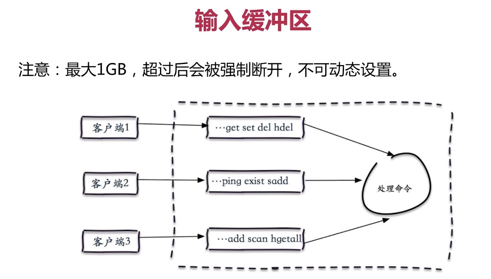
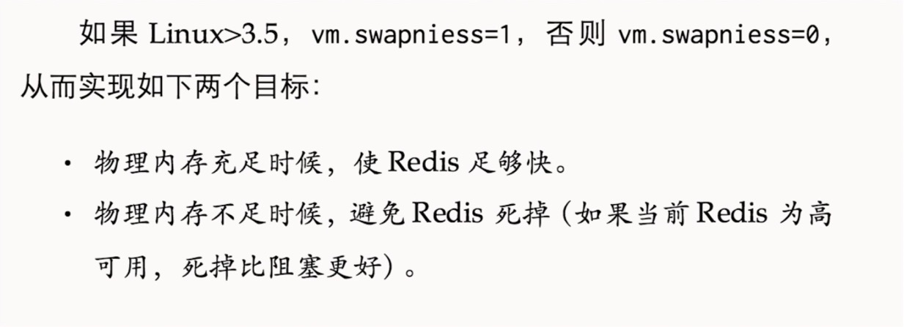

# 开篇之词

经过前两个比较实际的笔记之后，接下来就是比较玄幻的

# 一、内存管理

## 1.1内存消耗

想要查看redis的内存消耗，执行下面的命令查看

```
info Memory
```

以下是各种参数的含义：

| 属性名                  | 属性说明                                              |
| ----------------------- | ----------------------------------------------------- |
| used_memory             | redis分配器分配的内存量，也就是实际存贮数据的内存总量 |
| used_memory_human       | 以可读格式返回redis使用的内存总量                     |
| used_memory_rss         | 从操作系统的角度，redsi进程占用的总物理内存           |
| used_memory_peak        | 内存分配器分配的最大内存，代表used_memory的历史峰值   |
| used_memory_peak_human  | 以可读的格式显示内存消耗峰值                          |
| used_memory_lua         | lua引擎所消耗的内存                                   |
| mem_fragmentation_ratio | used_memory_rss/used_memory比值，表示内存碎片率       |
| mem_allocator           | redis所使用的内存分配器，默认：jemalloc               |

## 1.2 客户端缓冲区




## 1.3 内存设置上限


设置的命令如下

```
config set maxmemory 6GB
config rewrite
```

# 二、Linux相关参数优化

## 2.1 overcommit

vm.overcommit_memory参数含义


设置vm.overcommit_memory=1

## 2.2 swappiness




## 2.3 redis的安全

关于2015年的redis攻击手段查看如下

```
https://www.cnblogs.com/UnGeek/p/5571287.html
https://segmentfault.com/a/1190000007624311
```

## 2.4 redis安全法则

1.设置密码

3.bind