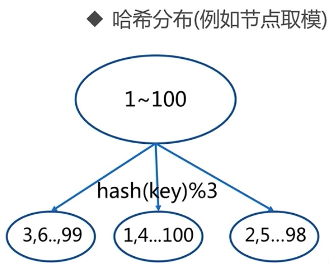

# 开篇之词

在redis学习笔记一中，介绍了比较基础的内容，在这个笔记中将介绍一些高级内容，如果允许的话，还会分析缓存穿透，无底洞等前沿问题。

# 一、redis复制的原理和优化

以下内容我是简化了很多东西，如果在真实服务器上去配置的话，建议阅读以下文档

```
http://redis.cn/topics/replication.html
```

其中需要关注的点，比如当配置了主从之后，开启持久化是一个很重要的考量项。

## 1.1 主从复制的简单描述

从节点去主节点那里拉取数据。一个master可以有多个slave，一个slave只能有一个master，数据流向是单向的，master到slave。

## 1.2 主从复制实现的两种方式

1.命令方式

在从节点上面执行slaveof命令，例如

```
redis-6380> slaveof 127.0.0.1 6379 # 意思是6380这个机器成为6379的从节点
```

从节点取消主从复制，比如，上面6380这个执行完命令以后就是6379的从节点了，现在想要恢复，那么则执行

```
redis-6380> slaveof no one # 执行完这个命令之后，6380将不在属于任何的从节点
```

2.配置方式

在从节点上修改以下配置

```
slaveof ip port # 添加端口号和IP
slave-read-only yes # 限制从节点只有读的权限
```

## 1.3 查看命令

```
info replication

-----------------
role:master # 这里可以查看是否是主节点
connected_slaves: 0 # 这里可以查看连接的从节点是多少个
```

## 1.4 主从复制的注意点

1.如果一个主节点想要成为某个主节点的从节点，那么当他执行slaveof命令之后，他本身的数据就会被清空，所以这一点需要特别注意，尽量不要拿已经有的主节点去修改为从节点，如果要修改为从节点，也要做好备份数据。

2.关于持久化，上文说到持久化有两种方式，其中RDB可以通过配置save的方式来自动开启，但是这里需要注意，即使关闭了这种配置的方式，在开启了主从复制的时候，主节点还会生成RDB文件，并且会做一个全量复制到从节点。

##1.5 runid和复制偏移量

在每个节点上，都会有一个runid，可以通过以下命令来查看当前节点的runid

```
redis-cli -p 6379 info server | grep run
```

查看偏移量

```
info replication

--------------------
slave0:ip=127.0.0.1,port=6380,state=online,offset=2048,lag=1 # offset为从节点的偏移量
master_repl_ofset: 2048 # 主节点的偏移量
```

## 1.6 全量复制


上面就是整个全量复制的过程，其中需要注意几个点，第一个点，master是执行bgsave做的本身的rdb文件。

第二个点，当主节点去发送send buffer的时候，从节点的以前的信息将被清空。

## 1.7 读写分离

读流量分摊到从节点，可能发生复制数据的延迟，就是主服务器写入了内容，从服务器还没有写入，这个时候去读取从服务器会有读不到的情况，一般不用太考虑这种问题，从业务上去规避比价好。

读到过期数据，从3.2版本已经解决

## 1.8 配置不一致

1.例如maxmemory不一致：丢失数据

## 1.9 复制风暴

假如一个master节点挂掉，再重启之后，他的runid将会发生变化，这个时候从节点就会进行全量复制，复制主节点的内容到从节点，如果有很多的从节点，则会发生大规模的复制，这就是复制风暴

# 二、Redis Sentinel(哨兵)

在开始介绍redis sentine之前，我们先来分析一下，上面主从复制产生的问题。最主要的问题就是主节点挂掉了，那么将不能进行重新写入内容，这个时候我们需要手动的故障转移，比如我们从从节点中选择一个节点出来当成新的主节点，然后再让其他的从节点从新去拉取新的主节点上的内容，这个过程其实是很复杂的，并且手动的来实现还是不能做到立即响应，那么redis sentinel就是这么一套机制，他可以监控redis的主从复制，然后当主节点挂掉之后，会自动的实现上面需要手动执行的这一套流程。

## 2.1 redis sentinel的架构


## 2.2 redis sentinel的故障转移过程


## 2.3 redis sentinel的主要配置

先来认识一个sentinel的主要配置

```
port ${port} # 端口号
dir "/home/redis/data" # 工作目录，虽然不存贮数据，但是可以日志
logfile "${port}.log" # 日志
sentinel monitor mymaster 127.0.0.1 7000 2 # mymaster监控的主节点的名字，2代表有两台sentine认为监控的主节点有了问题，从而去发生故障转移，127.0.0.1和7000就是IP和端口号
sentinel down-after-milliseconds mymaster 30000 # 表示去和主节点进行联系，比如ping，如果超过了30000毫秒，就是30秒，则认为不同，就是挂掉了
sentinel parallel-syncs mymaster 1 # 复制配置，每次复制只有一个，可以减轻master的压力
sentinel failover-timeout mymaster 180000 # 故障转移时间
```

## 2.4 sentinel的环境搭建

注意：下面的环境搭建过程过于简单，旨在为了说明sentinel，真实的搭建还是需要多考虑实际情况

vim redis-7000.conf

```
port 7000
daemonize yes
pidfile /var/run/redis-7000.pid
dir "/home/redis/data"
logfile "7000.log"
dbfilename "dump-7000.rdb" 
```

vim redis-7001.conf

```
port 7001
daemonize yes
pidfile /var/run/redis-7001.pid
dir "/home/redis/data"
logfile "7001.log"
dbfilename "dump-7001.rdb"
slaveof 127.0.0.1 7000
```

vim redis-7002.conf

```
port 7002
daemonize yes
pidfile /var/run/redis-7002.pid
dir "/home/redis/data"
logfile "7002.log"
dbfilename "dump-7002.rdb"
slaveof 127.0.0.1 7000
```

启动redis主从复制

```
redis-server redis-7000.conf
redis-server redis-7001.conf
redis-server redis-7002.conf
```

接下来配置sentinel的配置文件，默认的配置文件是在下载的目录下面有个sentinel.conf文件，和redis.conf是在同一级目录下面的。

vim redis-sentinel-26379.conf

```
port 26379
daemonize yes
dir /home/redis/data
logfile "26379.log"
sentinel monitor mymaster 127.0.0.1 7000 2
sentinel down-after-milliseconds mymaster 30000
sentinel parallel-syncs mymaster 1
sentinel failover-timeout mymaster 180000
```

接下来通过命令的方式修改剩余的两个配置文件

```
sed "s/26379/26380/g" redis-sentinel-26379.conf > redis-sentinel-26380.conf
sed "s/26379/26381/g" redis-sentinel-26379.conf > redis-sentinel-26381.conf
```

然后启动剩余的两个sentinel

```
redis-sentinel redis-sentinel-26379.conf
redis-sentinel redis-sentinel-26380.conf
redis-sentinel redis-sentinel-26381.conf
```

到此就配置好了redis sentinel。

## 2.5 故障转移演示

```php
<?php
require __DIR__.'/predis-1.1/src/Autoloader.php';
Predis\Autoloader::register();

# 用这种方式来连接redis-sentinel模式的集群
$sentinels = ['tcp://127.0.0.1:26379','tcp://127.0.0.1:26380','tcp://127.0.0.1:26380'];
$options = ['replication'=>'sentinel','service'=>'mymaster'];
$client = new Predis\Client($sentinels,$options);

$index = 0;
while(true){
   try{
      $client->set("foo","bar");
      $value = $client->get("foo");
      sleep(1);
      echo $index++;
      echo "\n";
    }catch(Exception $e){
      echo "error msg".$index++;
      echo "\n";
   }
}
?>
```

用上面的predis代码连接redis，然后切掉7000端口的redis，就会发现，30秒后7001端口变成主节点，7002节点变成7001的从节点，故障已经转移，这个时候再重启7000端口就会它变成7001的从节点，这就是故障转移的全部过程。

## 2.6 通过日志查看是否发生了故障转移

## 2.7 三个定时任务

1.每10秒每个sentinel对master和slave执行info

- 发现slave节点
- 确认主从关系

看下图：


2.每2秒每个sentinel通过master节点的channel交换信息(pub/sub)

- 通过\_\_sentinel\_\_:hello频道交互
- 交互对节点的“看法”和自身信息

关于这一部分，看下图：


3.每1秒每个sentinel对其他sentinel和redis执行ping的操作

- 心跳检测

看下图：


## 2.8 主观下线和客观下线

- 主观下线：每个sentinel节点对redis节点失败的“偏见”
- 客观下线：所有sentinel节点对redis节点失败“达成共识”（超过quorum个统一）
- sentinel is-master-down-by-addr

意思就是一个sentinel节点认为master下线了，这是他自己的偏见，需要问问其他人，如果超过了配置中的sentinel都认为下线了，则才会下线master。

## 2.9 领导者选举

当判定master节点失败的时候，会选举出一个sentinel作为主节点来完成故障转移。

选举：通过sentinel is-master-down-by-addr命令都希望成为领导者

1.每个做主观下线的sentinel节点向其他sentinel节点发送命令，要求将它设置为领导者

2.收到命令的sentinel节点如果没有同意通过其他sentinel节点发送的命令，那么将同意该请求，否则拒绝

3.如果该sentinel节点发现自己的票数已经超过sentinel集合半数且超过quorum，那么它将成为领导者

4.如果此过程有多个sentinel节点成为了领导者，那么将等待一段时间重新进行选举

## 2.10 故障转移

1.从slave节点中选出一个“合适的”节点作为新的master节点

2.对上面的slave节点执行slaveof no one命令让其成为master节点

3.向剩余的slave节点发送命令，让他们成为新master节点的slave节点，复制规则和parallel-syncs参数有关。

4.更新对原来master节点配置为slave，并保持着对其”关注“，当其恢复后命令它去复制新的master节点

上文提到选择合适的节点作为新的主节点，那么是如何选择的呢？

1.选择slave-priority（slave节点优先级）最高的slave节点，如果存在则返回，不存在则继续。

2.选择复制偏移量最大的slave节点（复制的最完整），如果存在则返回，不存在则继续

3.选择runid最小的slave节点

## 2.11 节点运维

所谓节点运维就是机器的上线和下线，例如以下情况我们会考虑下线机器。

1.机器性能不足：例如cpu，内存，硬盘，网络等。

2.节点自身故障：例如服务不稳定等

那么下线的话可以随便选择一台sentinel执行以下命令即可

```
sentinel failover <masterName>
```

# 三、Redis Cluster

前面我们说到了redis-sentinel，他是一种主从的高可用模式，但是现在问题来了，比如我们单机的内存是64G，我们需求的数据是600G呢？难道我们还要去买一个600G的内存的机器吗？显然不是很划算，这个时候我们就考虑将这些数据分布到不同的机器上面，这就是集群。

## 3.1 顺序分区和哈希分区

1.顺序分区


比如上图，我们有1到100个数字，那么顺序分区就是1到33占到一个区，34到66占到一个区，67到100占到另外一个区，这个是再分三个区的情况下的。

2.哈希分区



哈希分布就是对key取hash值，然后对3取模，这里的三代表三个分区。

## 3.2 虚拟槽分区

预设虚拟槽：每个槽映射一个数据子集，一般比节点数大

看下图：


在redis-cluster中一共有16383个槽，刚开始可以分配槽给每个节点，然后当有来了数据之后，对16383进行hash，然后就知道是在哪个槽里面了，然后去请求是在哪个节点管理的，即使不是当前节点，也会返回具体是哪个节点，就可以找到数据了。

其实上面的很简单，只不过第一次接触会有些难，可以参考如下文章进行学习

```
https://www.cnblogs.com/wxd0108/p/5729754.html
```

## 3.3 架构图


## 3.4 原生命令安装

vim redis-7000.conf

```
port 7000
daemonize yes
# 这里的工作目录最好配置到logfile目录的前面
dir "/home/redis/data"
logfile "7000.log"
dbfilename "dump-7000.rdb"
# 代表这是集群
cluster-enabled yes
# 集群的配置文件
cluster-config-file nodes-7000.conf
# 这个参数代表如果是yes表示集群中有任一台不工作了，则整个集群不提供服务，所以把它关闭
cluster-require-full-coverage no
```

快速生成其他的节点配置

```
sed 's/7000/7001/g' redis-7000.conf > redis-7001.conf
sed 's/7000/7002/g' redis-7000.conf > redis-7002.conf
sed 's/7000/7003/g' redis-7000.conf > redis-7003.conf
sed 's/7000/7004/g' redis-7000.conf > redis-7004.conf
sed 's/7000/7005/g' redis-7000.conf > redis-7005.conf
```

然后启动配置

```
redis-server redis-7000.conf
redis-server redis-7001.conf
redis-server redis-7002.conf
redis-server redis-7003.conf
redis-server redis-7004.conf
redis-server redis-7005.conf
```

执行meet（握手）操作

```
redis-cli -p 7000 cluster meet 127.0.0.1 7001
redis-cli -p 7000 cluster meet 127.0.0.1 7002
redis-cli -p 7000 cluster meet 127.0.0.1 7003
redis-cli -p 7000 cluster meet 127.0.0.1 7004
redis-cli -p 7000 cluster meet 127.0.0.1 7005
```

查看集群状态

```
redis-cli -p 7000 cluster nodes
```

或者

```
redis-cli -p 7000 cluster info
```

接下来就是分配槽了,对于分配槽这个事情，如果分配一个槽可以用下面这个命令

```
redis-cli -p 7000 cluster addslots 0 # 表示把0这个槽分配给7000来管理
```

我们分析，redis一共有16385个槽，一个个手写怕是写到天黑也写不完，所以写一个shell脚本的方式来进行分配

Vim addslots.sh

```
start=$1
end=$2
port=$3
for slot in `seq ${start} ${end}`
do
  echo "slot:${slot}"
  redis-cli -p ${port} cluster addslots ${slot}
done
```

然后执行

```
sh addslots.sh 0 5461 7000 #表示把0到5461这些槽分配给7000去管理
```

执行完毕之后去看一下分配的槽信息

```
redis-cli -p 7000
127.0.0.1:7000> cluster info

------------------------------
cluster_slots_assigned:5462 # 表示有5462个槽在这里被管理
```

然后执行

```
cluster nodes

-----------------
# 这里0-5461表示被管理，这里xxx是简写
56xxxxxxx.....xxx 127.0.0.1:7000 myself,master - 0 0 1 connected 0-5461 
```

将剩余的槽分配完

```
sh addslots.sh 5462 10922 7001
sh addslots.sh 10923 16383 7002
```

接下来进行主从的分配

```
# 这里56xxxx.xxx是7000的ID，可以通过上买呢cluster nodes进行查看，这个命令的意思就是7003作为7000的从节点
redis-cli -p 7003 cluster replicate 56xxxxxxx...xxx 
```

然后将两外两个也做分配,需要注意，哪个作为哪个的从节点，这里的就要写主节点的ID

```
redis-cli -p 7004 cluster replicate 56xxxxxxx...xxx(主节点的ID) 
redis-cli -p 7005 cluster replicate 56xxxxxxx...xxx(主节点的ID)
```

到此，我们用命令的方式就安装好了redis cluster。

下面是分配好的，可以以此来参考。

```
[root@node01 sh-dir]# redis-cli -p 7000 clusternodes
f9d44d4b4e0f3fd6da4d5052236d39fbd03852a9 127.0.0.1:7001@17001 master - 0 1578225578606 0 connected 5462-10922
0be970d510fbc5b51926b324d46c15f8dd79bdcb 127.0.0.1:7000@17000 myself,master - 0 1578225578000 1 connected 0-5461
8f23180bc5dff6f255bb14e31954811c43a473aa 127.0.0.1:7002@17002 master - 0 1578225577594 2 connected 10923-16383
cd3f63843bfa6d923d2ed58a9701ceb7bc7d5e6a 127.0.0.1:7003@17003 slave 0be970d510fbc5b51926b324d46c15f8dd79bdcb 0 1578225577000 3 connected
6731ef56115d09606473b886b93bdf6a1e5571d9 127.0.0.1:7004@17004 slave 8f23180bc5dff6f255bb14e31954811c43a473aa 0 1578225578000 4 connected
f00b917348a763ebc2874c89d9c6a0f985c51726 127.0.0.1:7005@17005 slave f9d44d4b4e0f3fd6da4d5052236d39fbd03852a9 0 1578225579621 5 connected
```

标示master是主节点，slave是从节点。

## 3.5 redis官方提供的工具安装

### 3.5.1安装ruby

```
wget https://cache.ruby-lang.org/pub/ruby/2.7/ruby-2.7.0.tar.gz
tar -zxvf ruby-2.7.0.tar.gz
cd ruby-2.7.0
./configure --prefix=/usr/local/ruby
make && make install
```

需要注意的是，不要忘记配置环境变量哦！

最后用以下命令检查一下

```
ruby -v

---------------
ruby 2.7.0p0 (2019-12-25 revision 647ee6f091) [x86_64-linux]
```

标示安装成功！

### 3.5.2 安装ruby的redis客户端

```
wget https://rubygems.org/downloads/redis-3.3.0.gem
gem install -l redis-3.3.0.gem
gem list -- check redis gem
```

### 3.5.3 redis-trib.rb

Redis-trib.rb是redis 官方提供一个搭建集群的工具，但是原理依旧还是和手动安装一样，但是可以简化我们的工作。

接下来进行演示，演示之前先按照上面手动的命令进行8000到8005的server。

````
redis-server redis-8000.conf
redis-server redis-8001.conf
redis-server redis-8002.conf
redis-server redis-8003.conf
redis-server redis-8004.conf
redis-server redis-8005.conf
````

开始创建集群

```
# create表示创建集群 --replicas表示每个主节点有几个从节点，后面写1表示每个主节点有一个从节点
# 然后跟着就是配置的服务，紧跟着三个就是主节点，再后面三个就是从节点
./home/redis/redis/src/redis-trib.rb create --replicas 1 127.0.0.1:8000 127.0.0.1:8001 127.0.0.1:8002 127.0.0.1:8003 127.0.0.1:8004 127.0.0.1:8005


----------------------------------------
# 本来执行上面的命令就可以了，但是新版本的，比如我安装的是5.x版本，会提示用一下命令代替，效果是一样的
redis-cli --cluster create 127.0.0.1:8000 127.0.0.1:8001 127.0.0.1:8002 127.0.0.1:8003 127.0.0.1:8004 127.0.0.1:8005 --cluster-replicas 1
# 上面执行完毕之后会打印计划，然后输入yes即可
yes
```

至此集群搭建完毕

## 3.6原声命令和redis-trib.rb对比

原声命令安装是不会再实际中使用的，官方提供的工具是更好的选择。

# 四、深入理解redis cluster

第三节我们搭建好了redis cluster，那么这一节就来聊聊集群的那些事情。

## 4.1 集群的扩容操作

上面我们已经搭建好了集群了，现在我们想要添加8006和8007两个节点，如下操作

```
sed 's/8000/8006/g' redis-8000.conf > redis-8006.conf
sed 's/8000/8007/g' redis-8000.conf > redis-8007.conf
```

然后启动

```
redis-server redis-8006.conf
redis-server redis-8007.conf
```

加入集群

```
redis-cli -p 8000 cluster meet 127.0.0.1 8006
redis-cli -p 8000 cluster meet 127.0.0.1 8007
```

主从分配

```
redis-cli -p 8007 cluster replicate 56xxxx...xxxx(8006的ID)
```

迁移数据

```
redis-trib.rb reshard 127.0.0.1:7000

-----------------------------------
# 这里会打印槽的信息等等
...........
# 你希望迁移多少个槽
How many slots do you want to move(from 1 to 16384)? 4096 # 这里写希望迁移的槽个数，这里我写的4096
# 你希望哪个ID是接收的，就是将这些槽给到哪个节点，然后填入他的ID
What is the receiving node ID? 56xxxx...xxx # 我这里填写的8006的ID
Source node #1:all  # 填入all即可
.................
# 你是否想要继续这个过程
Do you want to proceed with the proposed reshard plan(yes/no)?yes # 这里填写yes
```

然后查看槽的分配

```
redis-cli -p 8000 cluster nodes | grep master
```

至此扩容完成。

## 4.2 集群的缩容操作

缩容就是下线节点操作。

先进性迁移槽

```
# 表示从哪个地方迁移到哪个地方 1366表示迁移的槽的个数
redis-trib.rb reshard --from 56xxx....xx --to 56xxx...xxx --slots 1366 127.0.0.1:8006

-------------------
yes
```

下线操作，需要先下线从节点，然后再下线主节点，如果顺序反了，则会触发故障转移

```
# 这里的56xxxx...xxx表示要删除的节点，其实底层执行的就是forget操作
redis-trib.rb del-node 127.0.0.1:7000 56xxx....xxx
```

## 4.3 moved异常和操作

先来看一下流程图


## 4.4 ask重定向


## 4.5 moved和ask的对比

1.两者都是客户端重定向

2.moved：槽已经确定迁移

3.ask：槽还在迁移中

## 4.6 故障转移

### 4.6.1主观下线流程


### 4.6.2客观下线


## 4.7 集群完整性

主要关注下面这个选项

```
cluster-require-full-coverage yes
```

默认情况下是yes，表示集群中16384个槽必须全部可用，集群才对外提供服务，在实际情况下，不实用，所以我们要把改成yes。

## 4.8 带宽消耗

官方建议，集群的节点不要超过1000个，不然会增加不容忽视的带宽消耗。

消息发送频率：节点发现与其他节点最后通信时间超过cluster-node-timeout/2时会直接发送ping消息

消息数据量：slots槽数组(2k空间)和整个集群1/10的状态数据（10个节点状态数据约1kb）

节点部署的机器规模：集群分布的机器越多且每台机器划分的节点数约均匀，则集群内整体的可用带宽越高

## 4.9 Pub/Sub广播

问题：publish在集群中每个节点广播：加重带宽

解决：单独“走”一套redis sentinel

## 4.10 数据倾斜

1.节点和槽分配不均

```
redis-trib.rb info ip:port # 查看节点、槽、键值分布
```

```
redis-trib.rb rebalance ip:port # 进行均衡(谨慎使用)
```

2.不同槽对应键值数量差异较大

3.包含bigkey

```
redis-cli --bigkeys # 查看大字符串
```

4.内存相关配置不一致

## 4.11 请求倾斜

热点key：重要的key或者bigkey

## 4.12 读写分离

集群模式的从节点不接受任何读写请求

## 4.13 数据迁移

1.官方迁移工具：redis-trib.rb import

- 只能从单机迁移到集群
- 不支持在线迁移：source需要停写
- 不支持断点续传
- 单线程迁移：影响速度

2.在线迁移

- 唯品会：redis-migrate-tool
- 豌豆荚：redis-port

## 4.14 集群vs单机

集群限制

- key批量操作支持有限：例如mget、mset必须在一个slot
- key事务和lua支持有限：操作的key必须在一个节点
- key是数据分区的最小粒度：不支持bigkey分区
- 不支持多个数据库：集群模式下只有一个db 0
- 复制只支持一层：不支持树形复制结构

# 五、缓存的优化和设计

## 5.1 缓存的收益和成本

收益：

1.加速读写

2.降低后端负载

- 后端服务器通过前端缓存降低负载：业务端使用redis降低后端mysql的负载

成本：

1.数据不一致：缓存层和数据层有时间窗口不一致，和更新策略有关

2.代码维护成本：多了一层缓存逻辑

3.运维成本：例如redis cluster

使用场景：

1.降低后端负载：

- 对高消耗的sql：join结果集/分组统计结果缓存

2.加速请求响应

- 例如redis/memcache优化IO响应时间

3.大量写合并为批量写

- 如计数器先redis累加再批量写db

## 5.2 缓存的更新策略

1.LRU/LFU/FIFO算法剔除：例如maxmemory-policy

2.超时剔除：例如expire

3.主动更新：开发控制生命周期


## 5.3 缓存粒度控制

1.通用性：全量属性更好

2.占用空间：部分属性更好

3.代码维护：表面上全量属性更好

## 5.4 缓存穿透问题


当请求去请求redis的时候，redis并没有，于是去到mysql查找，但是mysql也不存在，于是导致绝大部分的请求都直接打到mysql，丧失了redis作为缓冲的意义，可能导致mysql崩溃，这就是缓存穿透。

产生的原因：

1.业务代码自身问题

2.恶意攻击、爬虫等等

如何发现：

1.业务的响应时间

2.业务本身问题

3.相关指标：总调度数、缓存层命中数、存贮层命中数

解决方案：

1.缓存空对象


存在的问题

1.需要更多的键

2.缓存层和存贮层数据“短期”不一致


## 5.5 缓存雪崩优化


1.保证缓存高可用

- 个别节点、个别机器、甚至是机房
- 例如redis cluster、Redis sentinel、VIP(虚拟IP)

2.依赖隔离组件为后端限流

3.提前演练：例如压力测试

## 5.6 无底洞问题

问题描述：

2010年，Facebook有了3000个Memcache节点

发现问题：“加”机器性能没能提升，反而下降

## 5.7 热点key的重建优化

待更新。。。

